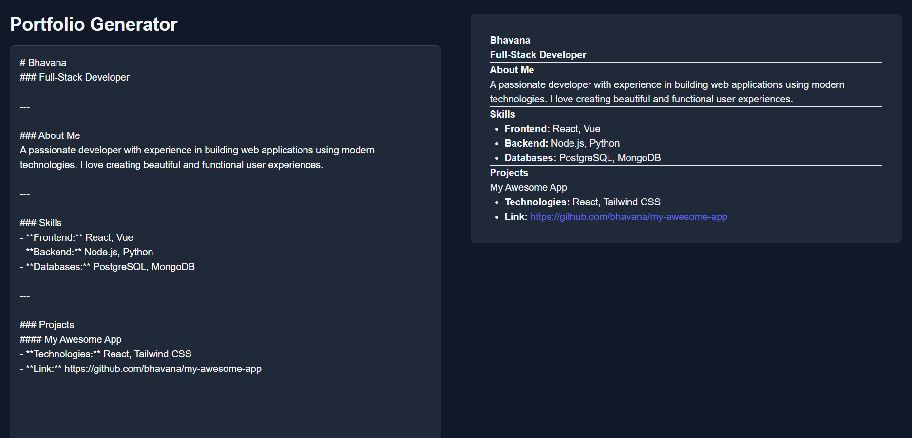

# 🚀 Portfolio Generator

Portfolio Generator is a web application that helps users generate a clean and responsive personal portfolio website quickly and easily.

## 📸 Preview



## ✨ Features

* Generate a professional portfolio
* Responsive design
* Easy customization
* Clean user interface
* Beginner-friendly

## 🛠️ Technologies Used

* HTML5
* CSS3
* JavaScript

## 📂 Project Structure

```text
portfolio-generator/
│── index.html
│── style.css
│── script.js
│── preview.png
└── README.md
```

## 💻 How to Run

1. Clone the repository.
2. Open `index.html` in your browser.

## 🎯 Future Enhancements

* Export portfolio as PDF
* Multiple portfolio themes
* Live preview
* Custom templates

## 👩‍💻 Author

**Bhavana Vandanam**

